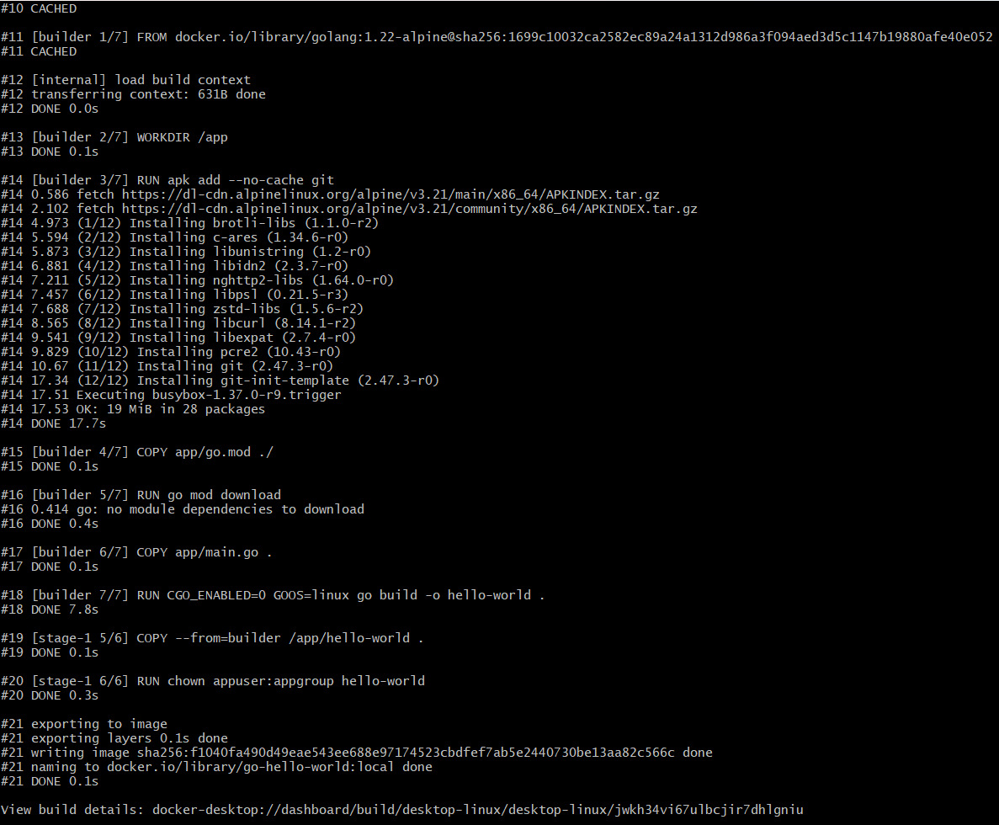
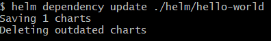
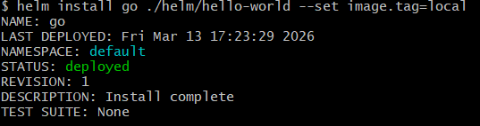
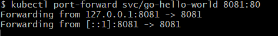
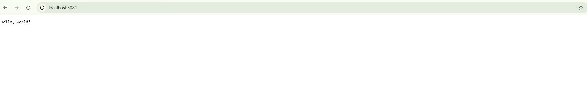
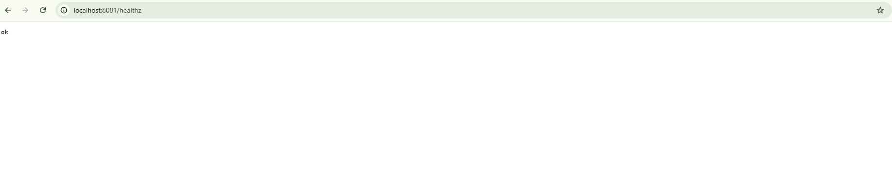
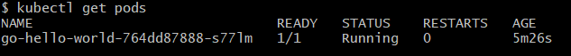
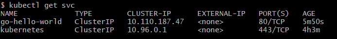

# hello-world
A simple Go 'Hello World' application that demonstrates the ability to containerize an app, build a CI/CD pipeline, and structure a Helm chart for Kubernetes deployment.

## Contents

### App Structure

```
.
├── Dockerfile
├── .github/
│   └── workflows/
│       └── ci.yml
├── app/
│   ├── main.go
│   └── go.mod
├── helm/
│   ├── hello-world/       
│   │   ├── Chart.yaml
│   │   ├── values.yaml
│   │   └── templates/
│   │       ├── deployment.yaml
│   │       └── service.yaml
│   └── lib-common/        
│       ├── Chart.yaml
│       └── templates/
│           ├── _helpers.tpl
│           ├── _deployment.tpl
│           └── _service.tpl
└── README.md                 
```

### Dockerfile
* A production-ready Dockerfile for building and running the Go application.
* Optimized for smaller image size and faster builds.

### GitHub Actions Workflow
* Automated CI/CD pipeline with three jobs:
    * Lint Helm Chart – ensures Kubernetes manifests follow best practices.
    * Lint Dockerfile – validates Dockerfile syntax and structure.
    * Build Docker Image – compiles and packages the Go app into a container image.

### Helm Chart
* A Helm chart that deploys the application to Kubernetes.
* Includes templates for Deployment, Service, and other Kubernetes resources.
* Configurable values for flexible deployments.

## Library Chart Fixes
* Fixed (`ports:`) indent level in `_deployment.tpl`  to avoid rendering invalid manifests.
* Added default values for probe paths (`/healthz`) to prevent Helm errors if values are missing.
* Added appVersion to original `Chart.yaml` to show the correct labels version - Without `appVersion`, the label `app.kubernetes.io/version` falls back to `"0.0.0"` in `_helpers.tpl` while `appVersion` is optional for a library chart - Recommendation.

## Local Test
* Docker Desktop should be installed (Choose the correct installer for the system to install). 
* Enable Kubernetes in Docker Desktop.
* Install Helm and update the system path.
* Run `helm version` to confirm that `helm` is working.

### Setup and Build 
* Build the image with a tag:
    ```
    docker build -t go-hello-world:local . 
    ```
*  Update Helm dependencies (pull in lib-common) - This pulls in lib-common chart as a local dependency:
    ```
    helm dependency update ./helm/hello-world
    ```
* Install the chart - Deploy the app into the Kubernetes cluster:
    ```
    helm install go ./helm/hello-world --set image.tag=local
    ```
* Port-forwarding service:
    ```
    kubectl port-forward svc/go-hello-world 8081:80
    ```

### Running Services

From the Terminal, run the below commands:

* To show the running containers (pods),
    ```
    kubectl get pods
    ```
* To show the network services that expose those pods,
    ```
    kubectl get svc
    ```

### Screenshots









## References
* [Docker Desktop Installation](https://docs.docker.com/desktop/)
* [Helm Chart Installation](https://github.com/helm/helm/releases)
* [Haskell Dockerfile Linter](https://github.com/hadolint/hadolint)